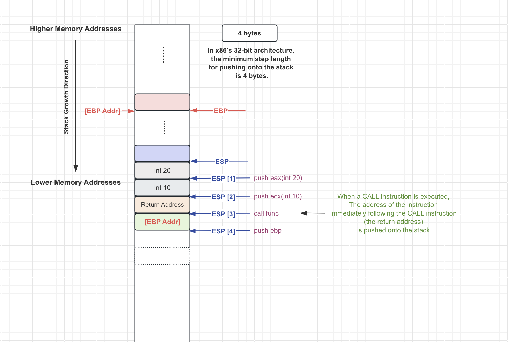
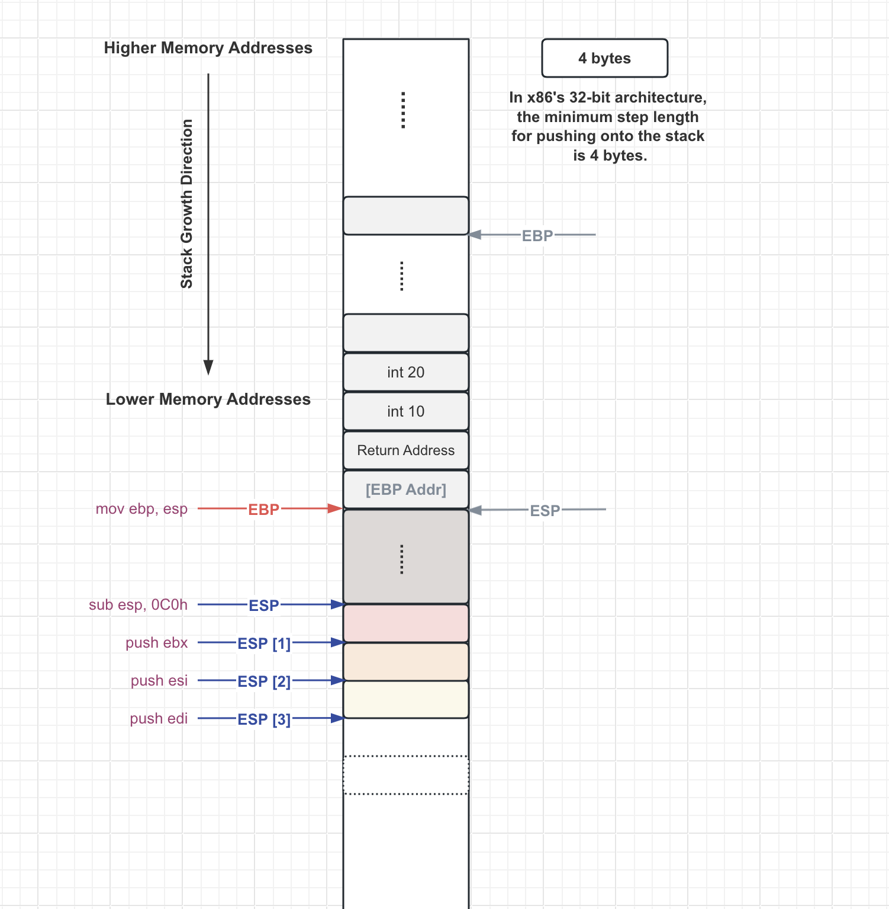
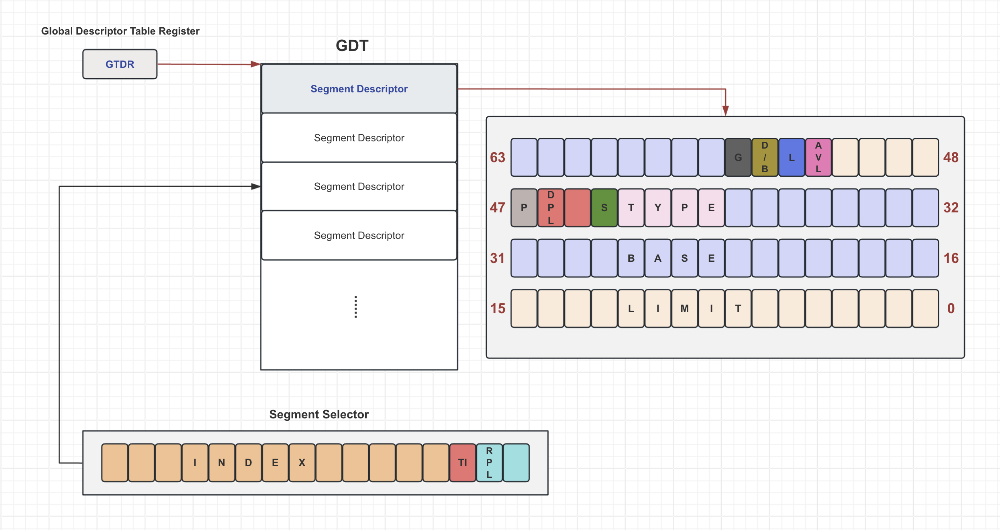
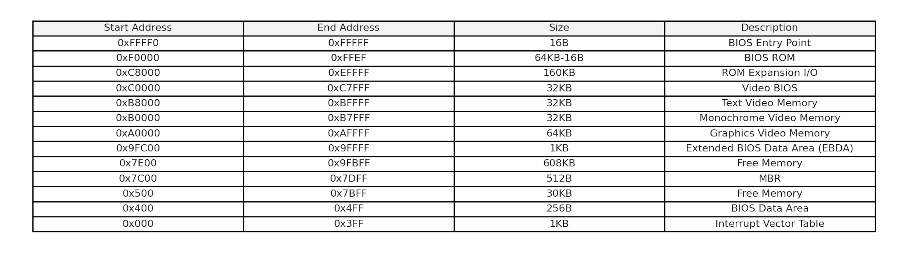
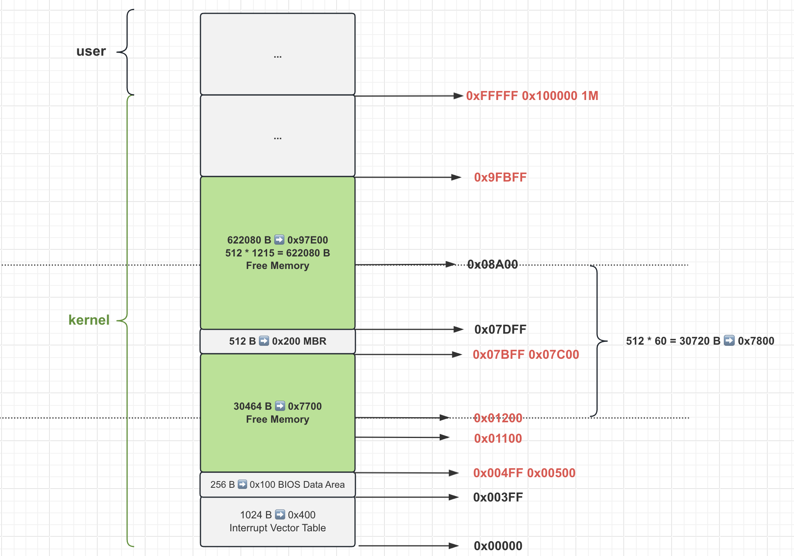
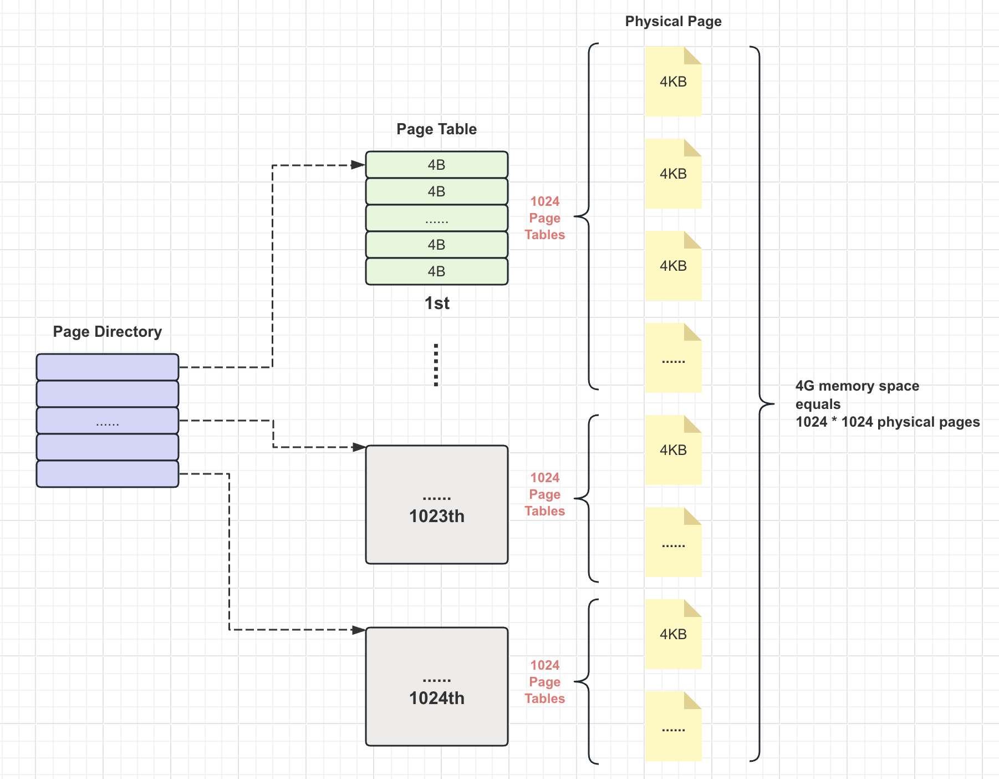

# Function Call - Assembly Perspective

Sample C source code

```c
int max(int a, int b)
{
    if (a > b)
    {
        return a;
    }
    
    return b;
}

int main()
{
    int a = 10;
    int b = 20;
    
    int c = max(a, b);
    
    return 0;
}
```

Disassembly code

```text
int main()
{
...

	int a = 10;
0017142E C7 45 F8 0A 00 00 00 mov         dword ptr [ebp-8],0Ah  
	int b = 20;
00171435 C7 45 EC 14 00 00 00 mov         dword ptr [ebp-14h],14h  

	int c = max(a, b);
0017143C 8B 45 EC             mov         eax,dword ptr [ebp-14h]  
0017143F 50                   push        eax  
00171440 8B 4D F8             mov         ecx,dword ptr [ebp-8]  
00171443 51                   push        ecx  
00171444 E8 CA FC FF FF       call        00171113  
00171449 83 C4 08             add         esp,8  
0017144C 89 45 E0             mov         dword ptr [ebp-20h],eax  

	return 0;
0017144F 33 C0                xor         eax,eax  
}

int max(int a, int b)
{
001713C0 55                   push        ebp  
001713C1 8B EC                mov         ebp,esp  
001713C3 81 EC C0 00 00 00    sub         esp,0C0h  
001713C9 53                   push        ebx  
001713CA 56                   push        esi  
001713CB 57                   push        edi  

...

	if (a > b)
001713DE 8B 45 08             mov         eax,dword ptr [ebp+8]  
001713E1 3B 45 0C             cmp         eax,dword ptr [ebp+0Ch]  
001713E4 7E 05                jle         001713EB  
	{
		return a;
001713E6 8B 45 08             mov         eax,dword ptr [ebp+8]  
001713E9 EB 03                jmp         001713EE  
	}

	return b;
001713EB 8B 45 0C             mov         eax,dword ptr [ebp+0Ch]  
}
001713EE 5F                   pop         edi  
001713EF 5E                   pop         esi  
001713F0 5B                   pop         ebx  
001713F1 8B E5                mov         esp,ebp  
001713F3 5D                   pop         ebp  
001713F4 C3                   ret  

...

max:
00171113 E9 A8 02 00 00       jmp         001713C0  

...
```





# GDT



# Real Mode - Memory Layout



In ROM, the physical address **0xFFFF0** typically contains a jump instruction, specifically `jmp 0xf000:0xe05b`. This
instruction is crucial for the boot-up process of a computer.

The ROM chip contains several components, primarily focused on hardware diagnostics, detection, and initialization. This
is a critical phase during the startup of a computer, where the system checks and prepares its hardware components for
operation.

Additionally, the ROM includes a set of software routines that facilitate interaction with peripheral devices. These
routines allow for data input from or output to these peripherals without requiring the user to understand the intricate
details of the hardware.

The software routines provided in the BIOS (Basic Input/Output System) are fundamental and cover standard
functionalities. This makes the BIOS a pivotal component in managing basic communications between the operating system
and hardware devices.

The ROM-BIOS plays a key role in the boot process by reading the contents of the hard drive's master boot record (MBR)
and loading it into the memory at the address **0x0000:0x7c00**. Following this, the BIOS executes a `jmp` instruction
to this
memory address, continuing the boot sequence.

# Memory layout of this project



```text
0x07C00         boot.o
0x00500         setup.o
0x01200         system.bin
0x01100	        memory info
0x010000        memory map
0x100000        free user memory
0x9FBFF         ESP
```

# 101012 paging



One item of **a page table** can cover 4KB of memory, exactly 12 bits (2^12=4096B).

One item of **a page dictionary table** can cover 4M of memory, which is the amount of memory **a page table** can cover, 
exactly 22 bits (2^22=4194304B=4096KB).

The address of a physical page must be 4KB aligned, so only the high 20 bits of the **page table** address need to be recorded in the table entry of the **page directory** (the last 12 bits are all zeros).

The address of a physical page must be 4KB aligned, so only the high 20 bits of the physical page address need to be recorded in the table entry of the **page table** (the last 12 bits are all zeros).
